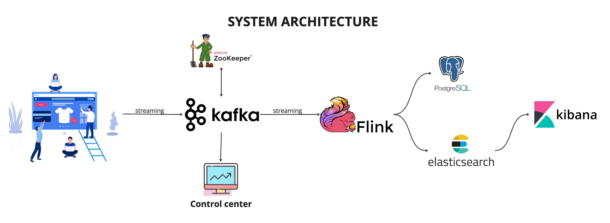
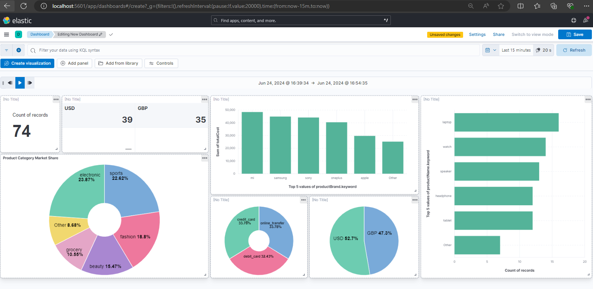

# REAL-TIME STREAMING AT SCALE WITH ECOMMERCE DATA
### \# End-to-end data pipeline

**Author:** Thanh Dinh  
**Start date:** 20/6/2024  
**Description:** This project is used for real-time sales analytics with the capabilities:
- Process financial transaction data
- Perform aggregations
- Store data in database
- Visualize

## Architecture


- **Docker Compose** is used to orchestrate the necessary infrastructure components, including Apache Flink, Elasticsearch, and Postgres. 
- The transaction data will be streamed from **Apache Kafka**, processed by **Apache Flink**. 
- Next step, data will be stored in both **PostgreSQL** and **Elasticsearch** database for further analysis.
- Finally, **Kibana** is used for a simple visualization.  


**Note**: This project ont only stream data into PostgreSQL but also the MySQL and MongoDB. You can see the commands for these 2 database and whole project in file [commands.md](./commands.md).

## Getting started

```shell
docker compose -f docker-compose.yml -p demo up -d
```

Go into Kafka broker container, and execute the command to check whether it lives or not:
```shell
kafka-topics --list --bootstrap-server broker:29092
```

Remember to install *faker*, *confluent_kafka*, and *singlejson*
```shell
pip install faker
pip install confluent_kafka
pip install singlejson
```

Go into broker container in Docker UI or use the command
```shell
docker exec -it broker 
```
Use this command to create a consumer in Kafka
```shell
kafka-console-consumer --topic --bootstrap-server broker:29092
```
Run the Kafka producer and see whether the messages received by consumer  
*kafka_producer.py in directory ./src/main/python*
```shell
python3 kafka_producer.py
```

Install [Apache Flink](https://flink.apache.org/downloads/) (in WSL in case using Window) and follow the [tutorial](https://nightlies.apache.org/flink/flink-docs-stable/docs/try-flink/local_installation/). Then go to its directory (in this case *flink-1.19.0*) and do the command below:
```shell
vi conf/config.yaml
```
Then configure *numberOfTaskSlots* = 4, *parallelism* = 2. In case you want to map another port, you can modify the *rest.port*
```shell
.bin/start-cluster.sh
```
Additionally, you can check Flink’s [web UI](http://localhost:8081/) to monitor the status of the cluster and running job.
**

<font size="2">When starting cluster in WSL, we cannot use localhost:8081 outside wsl, use curl localhost:8081 in WSL to check whether the UI up</font>

Then back to the Java project and export <Flink_job>.jar file
```shell
mvn clean && mvn compile
mvn package
```
As a result, you can see there is a *.jar* file in *./target* directory. Now let submit the job into Flink with the below command (now your working directory is in your Java file):
```shell
# <.../.../flink> run -c <project_name>.<file_name> <jar_file_path>

~/flink-1.19.1/bin/flink run -c realtime_streaming_ecommerce.DataStreamJob target/realtime_streaming_ecommerce-1.0-SNAPSHOT.jar
```

After submitting sucessfully tasks into Flink, the data streamed from Kafka will be processed and write down to Postgres. Go into Postgres container and execute some commands to check the data.
```shell
# PostgreSQL
psql -U postgres
```

Applying some querries to see the data inside tables;
```sql
select * from transactions;
select * from sales_per_category;
select * from sales_per_day;
select * from sales_per_month;
```

Open [Kibana UI](localhost:5601), and go to Devtool in Elasticsearch:
```
GET transactions/_search
```

Moreover, you can transform data with some command:
```
GET transactions/_search


POST _reindex
{
  "source": {
    "index": "transactions"
  },
  "dest": {
    "index": "transaction_test"
  },
  "script": {
    "source": """
      ctx._source.transactionDate = new Date(ctx._source.transactionDate).toString();
    """
  }
}
GET transaction_test/_search


POST _reindex
{
  "source": {
    "index": "transactions"
  },
  "dest": {
    "index": "transaction_new"
  },
  "script": {
    "source": """
      SimpleDateFormat formatter = new SimpleDateFormat("yyyy-MM-dd'T'HH:mm:ss");
      formatter.setTimeZone(TimeZone.getTimeZone('UTC'));
      ctx._source.transactionDate = formatter.format(new Date(ctx._source.transactionDate));
    """
  }
}
GET transaction_new/_search
```

Move to *Dashboard* in the UI, treate the data view and configure fields:
- Name: TransactionDataView
- Index pattern: transaction_new
- Timestamp field: --- I don't want to use the time filter ---
Then save and *Create a dashboard* --> *Create visualization*, let drag-and-drop the elements that you want to illustrate. This time, I choose *productCategory.keyword*. Configure other factor: metric,...

After that, *Save and return* and arrange the position of this chart in the big picture. Add more and more to create Data dashboard. Furthermore, you can add Control (e.g: Add time slider control) or panel. 




Besides, we can configure the refresh cycle (20 sec). As a result, the changes in data will be reflected in the dashboard ervery 20 seconds.


